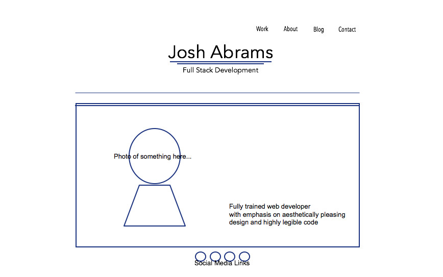
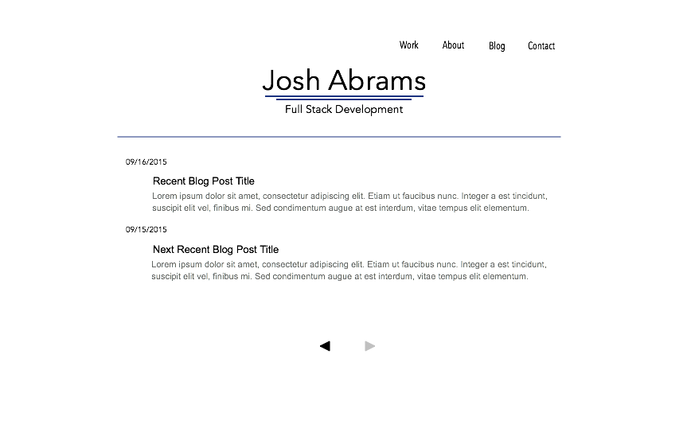

##2.4 Wirefreaming Reflection

###Home Page Wireframe

###Blog Index Wireframe

###What is a wireframe?

A wireframe is a rough mock-up sketch of your website as it will appear to the user and outlines how it will function. Wireframes are used as guidelines for how a website displays information to the user and how the user will interacts with information. Wireframes can contain varying levels of detail and can range from simple aesthetic breakdowns to detailed maps of scomplicated interactions.

###What are the benefits of wireframing?

Wireframing breaks down the user experience into a simple and presentable form which allows the designer and/or client to break down the website structure and disect if before any actual code is written. The is a key part of the development and UX as changing around website structure is easier, faster, and cheaper on a simple mock-up than it is in coding.

###Did you enjoy wireframing your site?

Wireframing my site was fun! It wasn't a particularly complex site design, but it was nice to bust out the graph paper and plot out my idea before I get started. I have some prior experience with basic web design and wireframing is one of my favorite parts.

###Did you revise your wireframe or stick with your first idea?

I came up with about three home page layouts before I landed on the one that I was happy with. I think that my first design ideas would have been too flashy and complicated for my current level of skill, so I'm going to stick with the one I have for now. I might change it back to one of the other ones though depending on how confident I am in my abilities over the coming weeks.

###What questions did you ask during this challenge? What resources did you find to help you answer them?

I ended up doing a lot of research into visual effects in Javascript and WebGL. My original design idea had content an animated menu at the bottom and all sorts of cool animations going on at the top, but I'll worry about that stuf when I actually know how to do it. I'm glad I checked though because at least I know what kind of effects are feasable now.

###Which parts of the challenge did you enjoy and which parts did you find tedious?

I enjoyed this challenge pretty thoroughly. I like sketching out ideas on graph paper and then moving them onto the computer, so this was a pretty easy one for me. No tedious bits.