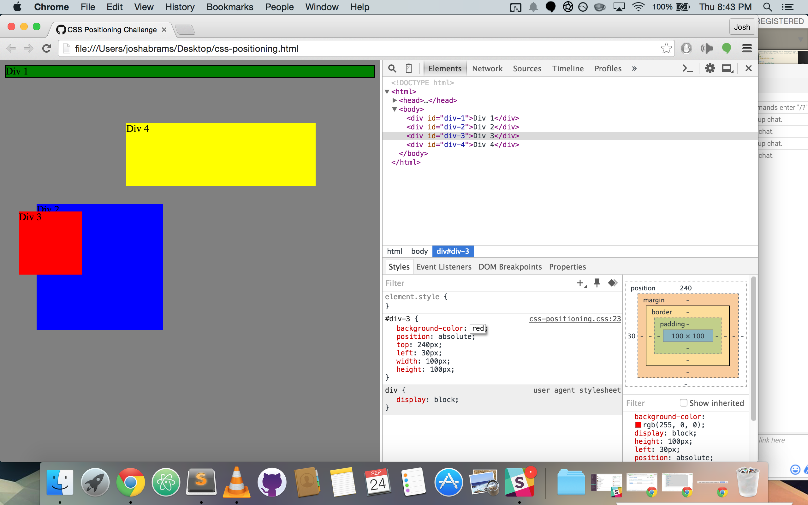
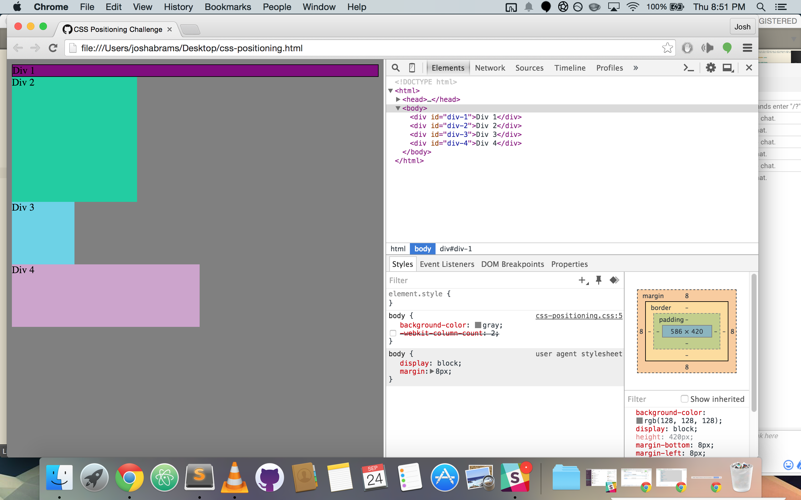
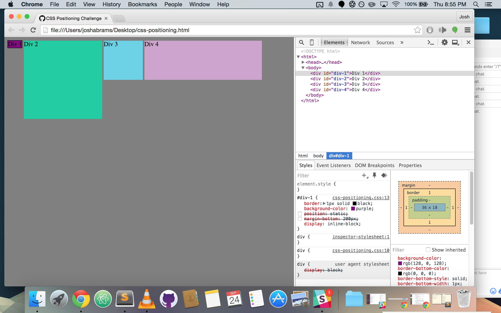
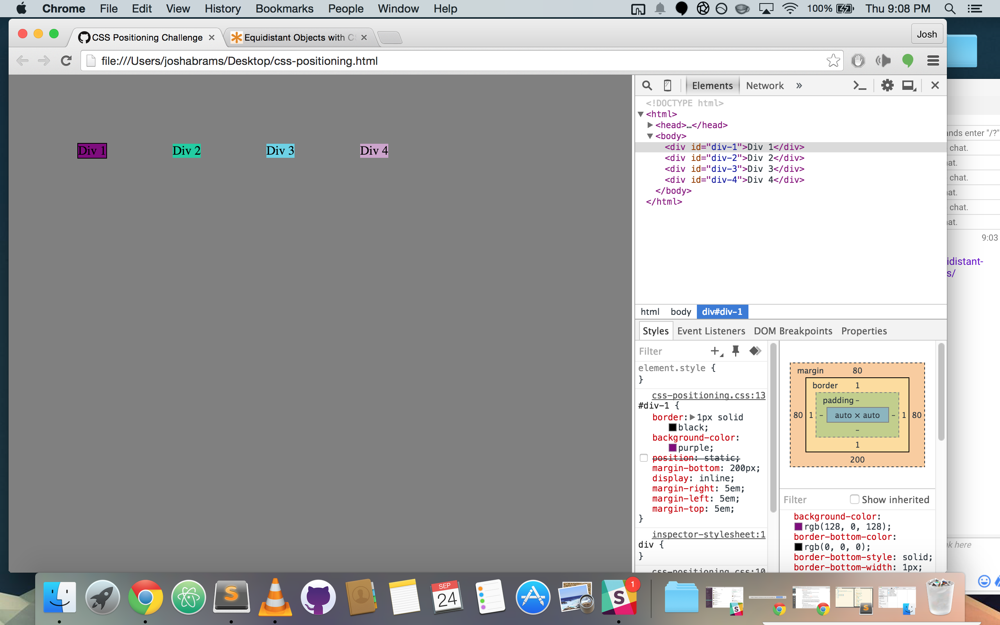
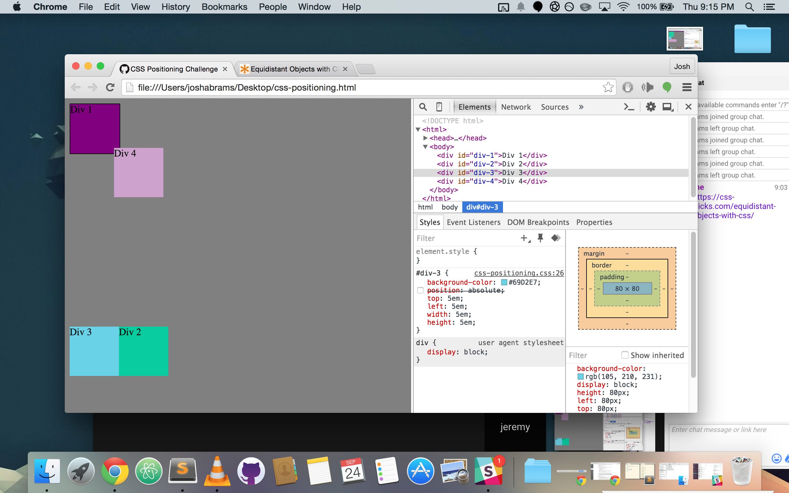
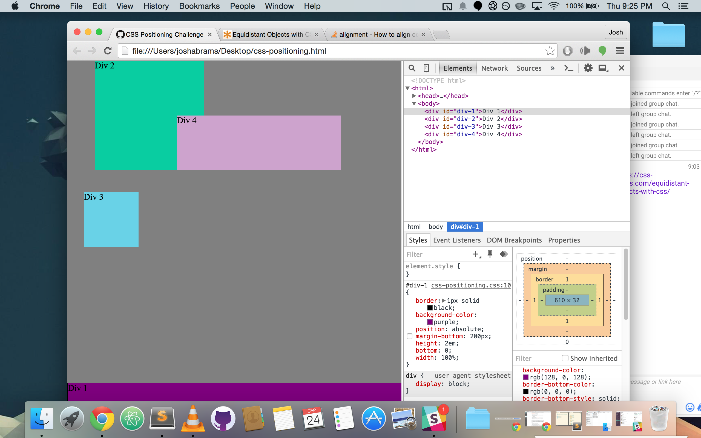
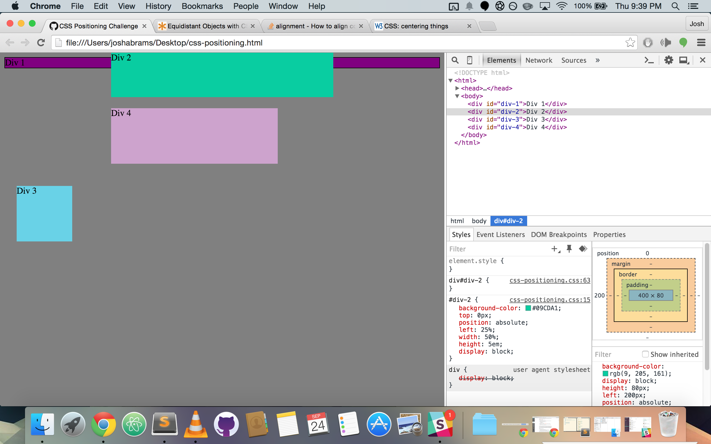
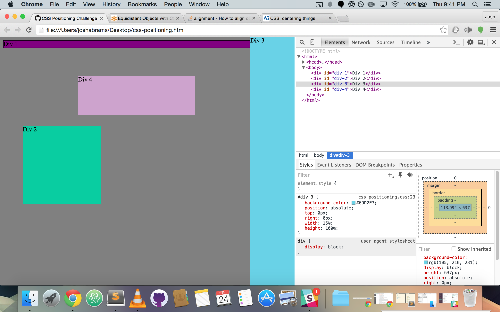
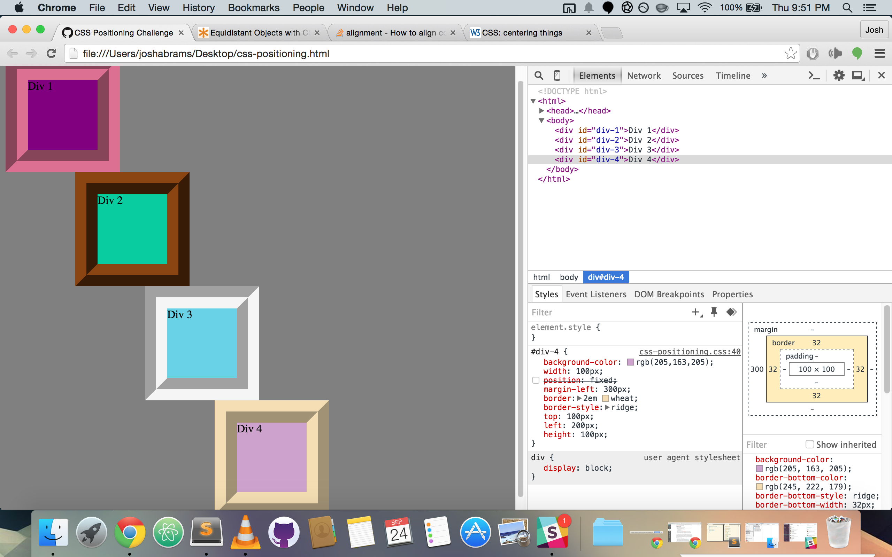

######Screenshot 1:

######Screenshot 2:

######Screenshot 3:

######Screenshot 4:

######Screenshot 5:

######Screenshot 6:

######Screenshot 7:

######Screenshot 8:

######Screenshot 9:

###How can you use Chrome's DevTools inspector to help you format or position elements?

DevTools allows you to reformat your CSS and see how it affects the web-page in real-time. This is useful because it means that you don't have to keep reloading your browser to see any changes and given the fickle nature of CSS, this can be a major help.

###How can you resize elements on the DOM using CSS?

You can resize elements in the DOM by going into the CSS section of the document and changing the width and height attributes of the element. You can set these to be relative to the to the screen size of the user by setting those attributes as percent value or 'em' as well.

###What are the differences between Absolute, Fixed, Static, and Relative positioning? Which did you find easiest to use? Which was most difficult?

Working with relative position became pretty easy and became more practical as I used it more and more. The most difficult to work with was absolute. I need to work with these positioning elements in more detail over the next few days to get a better grasp of them.

#####Absolute

Absolute positioning positions the element relative to the nearest positioned to its parent. This is useful for positioning elements within other elements.

#####Static

Static position works with the normal flow of the page and is not positioned relative to any page attribute.

#####Fixed

Fixed position places the element relative to the content of the entire window and stays in place no matter where on the webpage it is.

#####Relative

Relative positioning fixes the item in a way that makes it in the same place no matter where the user scrolls. This is useful when making things like headers, footers, and sidebars.

###What are the differences between Margin, Border, and Padding?

The margin is the area on the outside of the element.. The border is along the edge of the element. The padding is along the inside of the element.

###What was your impression of this challenge overall? (love, hate, and why?)

I didn't hate this challenge per-se so much as I hate the finicky-ness of CSS. The challenge actually highlighted how finicky CSS can be which was nice. When CSS works, it's a whole lot of fun, but when it comes to positioning elements, the language itself seems incomplete. I'm guessing CSS4 will be a life-saver for a lot of front-end developers.