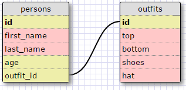

###Challenge 8.4 - Introduction to Databases

####Release 5: SELECTing from a database

**1. Select all data for all states:**

`SELECT * FROM states;`

**2. Select all data for all regions:**

`SELECT * FROM regions;`

**3.  Select the state_name and population for all states:**

`SELECT state_name, population FROM states;`

**4. Select the state_name and population for all states ordered by population. The state with the highest population should be at the top:**

`SELECT state_name, population FROM states ORDER BY population DESC;`

**5. Select the state_name for the states in region 7:**

`SELECT state_name FROM states WHERE region_id = 7;`

**6. Select the state_name and population_density for states with a population density over 50 ordered from least to most dense:**

`SELECT state_name, population_density FROM states WHERE population_density > 50 ORDER BY population_density;`

**7. Select the state_name for states with a population between 1 million and 1.5 million people:**

`SELECT state_name FROM states WHERE population BETWEEN 1000000 AND 1500000;`

**8. Select the state_name and region_id for states ordered by region in ascending order:**

`SELECT state_name, region_id FROM states ORDER BY region_id;`

**9. Select the region_name for the regions with "Central" in the name:**

`SELECT region_name FROM regions WHERE region_name LIKE "%Central%";`

**10. Select the region_name and the state_name for all states and regions in ascending order by region_id. Refer to the region by name. (This will involve joining the tables):**

`SELECT region_name, state_name FROM states LEFT JOIN regions ON states.state_name=regions.region_name;`

####Release 6: Your Own Schema

####Reflection

#####What are databases for?

Databases are for storing and organizing large amounts of data. SQL is a language
that allows users to manage digital databases. These databases are stored in the form
of one or multiple tables that arrange information in rows and columns where the individual
list items are stored in rows and the categories are stored in columns.

#####What is a one-to-many relationship?

A one-to-many relationship a specific type of relationship between two tables in a database.
This allows one column of the main table to correspond with another column of the related
table based on an information key from another database.

#####What is a primary key? What is a foreign key? How can you determine which is which?

The primary key is typically stored as an id number which is the first column of the main
table in the database. Any related tables will be linked to the main table via a foreign key
which is another column of information that exists within both tables. This secondary id tag
is used to store and query information over multiple tables.

#####How can you select information out of a SQL database? What are some general guidelines for that?

There are several different commands for querying data from within a SQL database. 

For instance, if you wanted to display all of the data in the table, you could just type:

`SELECT * FROM table;`
- with table being the table name. If you wanted to just display one column, you could alter that as:

`SELECT column FROM table;`
-with column being the column name. Ok. So say you want to select data from two columns and display it. Easy!

`SELECT column1, column2 FROM table;`
-and it will display both. Now, say you had a column in your table called 'age' and you only wanted to display
the ages of anyone over 20.

`SELECT name, age FROM table WHERE age > 20;`
-and it will display the name and age of anyone over 20. Ok. Last example. Say you have a table of first names
and last names. You want them to display by order of last name. You'd do:

`SELECT first_name, last_name FROM table ORDER BY last_name;`
And lo and behold, you've got it.

There are tons of ways to quiery. These are just a few, but they are some of the most common ones.