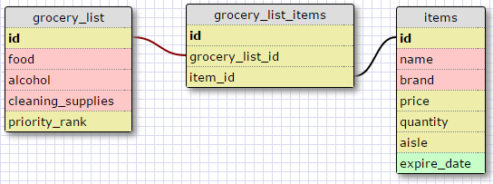

###One-to-One Database Schema

###Many-to-many Database Schema

####What is a one-to-one database?

A one-to-one database is a type of database that links two tables together via a foreign key. The foreign key
serves as a seperate id key for the secondary table. This way, one piece column of information from the primary
table can reference all of the data within the secondary table.

####When would you use a one-to-one database? (Think generally, not in terms of the example you created).

If you had a simple list of categories, but you want one category to contain several subcategories, you
would create a second table and link them.

####What is a many-to-many database?

A many-to-many database is a type of database relationship that connects 3 or more tables. The primary-key table then
becomes a common 'join' table for the database, though different tables can branch off of each other without necessarily
being connected to the primary table.

####When would you use a many-to-many database? (Think generally, not in terms of the example you created).

If you had a list of categories and you wanted more than one category to contain several subcategories,
then you would create a many-to-many database. You would also create one if your category contained
sub-sub-categories and so on.

####What is confusing about database schemas? What makes sense?

I think the only part of understanding database schemas that wasn't easy to intuit was when to add a new table
into a relationship. After looking at more examples though and watching the video, it's become a lot clearer.
Pretty much everything else about database schemas was pretty easy to grok.